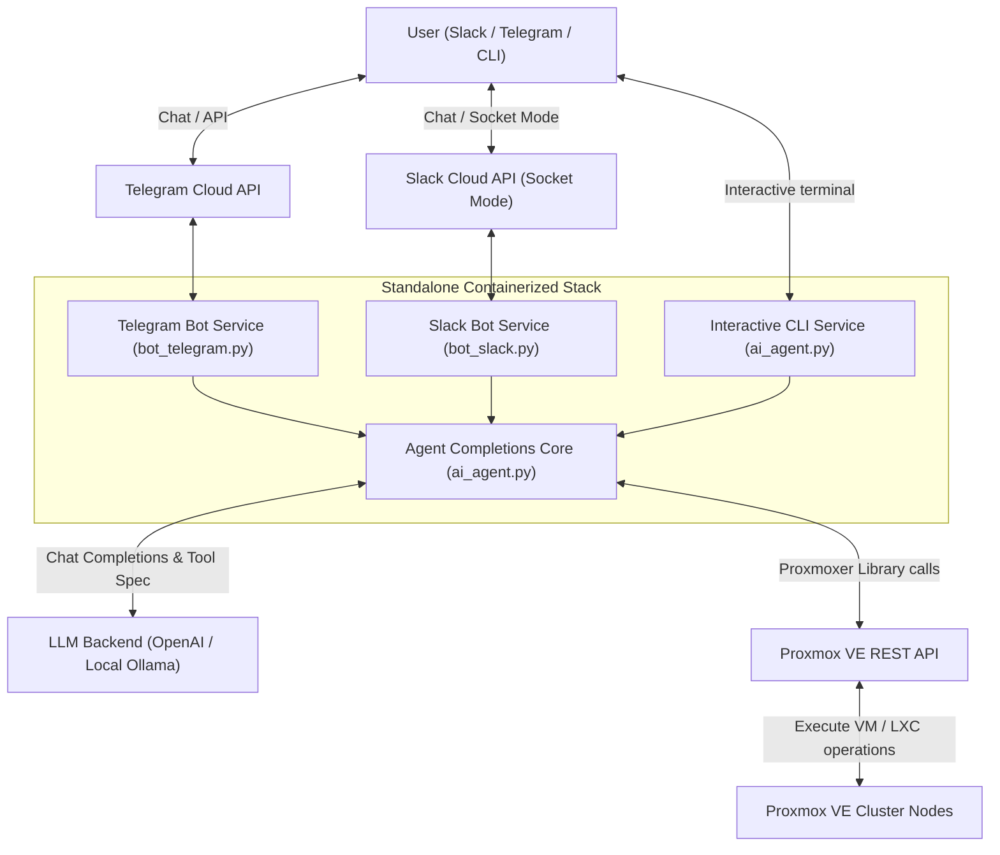

# Architecture Diagram

```mermaid
graph TD
    User["User (Slack / Telegram / CLI)"]
    Telegram["Telegram Cloud API"]
    Slack["Slack Cloud API (Socket Mode)"]
    
    subgraph Standalone Containerized Stack
        TelegramBot["Telegram Bot Service (bot_telegram.py)"]
        SlackBot["Slack Bot Service (bot_slack.py)"]
        CLI["Interactive CLI Service (ai_agent.py)"]
        CoreAgent["Agent Completions Core (ai_agent.py)"]
    end
    
    LLM["LLM Backend (OpenAI / Local Ollama)"]
    ProxmoxAPI["Proxmox VE REST API"]
    ProxmoxCluster["Proxmox VE Cluster Nodes"]

    User <-->|Chat / API| Telegram
    User <-->|Chat / Socket Mode| Slack
    
    Telegram <--> TelegramBot
    Slack <--> SlackBot
    User <-->|Interactive terminal| CLI
    
    TelegramBot --> CoreAgent
    SlackBot --> CoreAgent
    CLI --> CoreAgent
    
    CoreAgent <-->|Chat Completions & Tool Spec| LLM
    CoreAgent <-->|Proxmoxer Library calls| ProxmoxAPI
    ProxmoxAPI <-->|Execute VM / LXC operations| ProxmoxCluster
```
